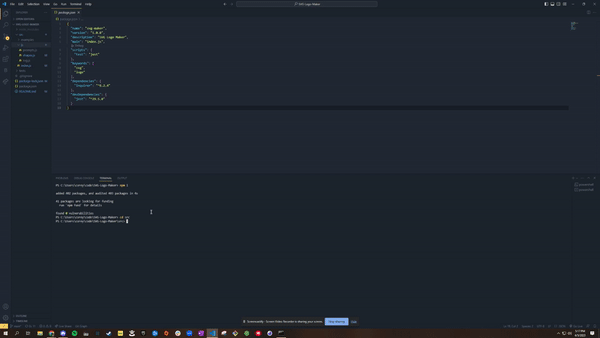

# SVG Logo Generator

## Description

This SVG Logo Generator is a Node.js command-line application designed to create high-quality, customizable SVG logos based on user input. The application prompts the user with a series of questions about their desired logo, including shape, color, and text, and generates an SVG file accordingly.

## Table of Contents
- [Installation](#installation)
- [Usage](#usage)
- [License](#license)
- [Contributing](#contributing)
- [Tests](#tests)
- [Questions](#questions)

## Installation
To install this application, follow these steps:

1. Clone the repository from GitHub
2. Download and install Node.js from the official website
3. Open your terminal and navigate to the root directory of the application
4. Install the required dependencies by running npm install

## Usage
To use this application, please follow the steps below:

1. Open your terminal and navigate to the root directory of the application
2. Start the application by running node index.js
3. Answer the questions that appear in your terminal
4. Once all questions have been answered, your SVG logo file will be generated and saved as logo.svg in the examples directory.

For a more detailed explanation of how to use this application, please refer to the [video tutorial](https://drive.google.com/file/d/1cTUb9dsdK1bA7VpMWlP6scw-Gk6rI_ai/view).

## License

This project is licensed under the MIT license. Click [here](https://opensource.org/licenses/MIT) for more information.

## Contributing
To contribute to this project, please read the installation section and ensure you have a solid understanding of the codebase. Contributions are welcome via pull requests.

## Tests
To run tests, use the command npm test. The tests are designed to validate the functionality of the shape classes and SVG rendering.

## Questions
If you have any questions, you can reach out to me on [GitHub](https://github.com/spamdalfz) or contact me directly at coreyvasser@gmail.com.